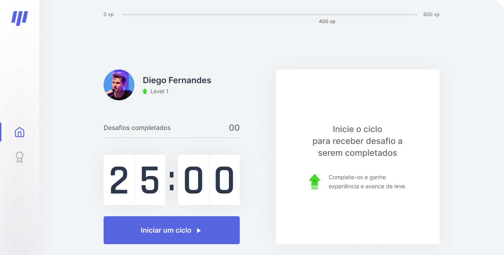

<h1 align="center">
    MoveIt NLW#04
</h1>

<p align="center">
  

  <a href="https://andrejr.dev">
    
  </a>
</p>

<p align="center" style="width: 60%; margin: 0 auto;">
  
</p>

<p align="center">
  <a href="#-tecnologias">Tecnologias</a>&nbsp;&nbsp;&nbsp;|&nbsp;&nbsp;&nbsp;
  <a href="#-projeto">Projeto</a>&nbsp;&nbsp;&nbsp;|&nbsp;&nbsp;&nbsp;
  <a href="#-clonando-projeto">Clonando Projeto</a>&nbsp;&nbsp;&nbsp;
</p>

<br>

## 🚀 Tecnologias

- [TypeScript](https://www.typescriptlang.org/)
- [NextJS](https://nextjs.org/)
- [Styled Components](https://styled-components.com/)
- [Jest](https://jestjs.io/)
- [React Testing Library](https://testing-library.com/docs/react-testing-library/intro)
- [Storybook](https://storybook.js.org/)
- [Eslint](https://eslint.org/)
- [Prettier](https://prettier.io/)
- [Husky](https://github.com/typicode/husky)

<br>

## 💻 Projeto

Projeto criado durante a NextLevelWeek#4 da [Rockeseat](https://rockeseat.com.br)

## Clonando Projeto

```bash
git clone https://github.com/andrejr971/moveit.git

npm install
# or
yarn
```

## Iniciando projeto

First, run the development server:

```bash
npm run dev
# or
yarn dev
```

Abrir [http://localhost:3000](http://localhost:3000).

## Commands

- `dev`: runs your application on `localhost:3000`
- `build`: creates the production build version
- `start`: starts a simple server with the build production code
- `lint`: runs the linter in all components and pages
- `test`: runs jest to test all components and pages
- `test:watch`: runs jest in watch mode
- `storybook`: runs storybook on `localhost:6006`
- `build-storybook`: create the build version of storybook

## Saiba mais

Saiba mais sobre Next.js:

- [Next.js Documentation](https://nextjs.org/docs) - learn about Next.js features and API.
- [Learn Next.js](https://nextjs.org/learn) - an interactive Next.js tutorial.
